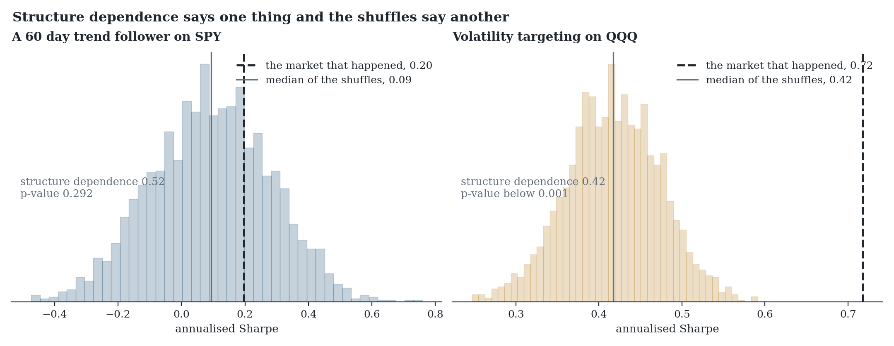

# OverfitLab

Give it a price or return series and it builds hundreds of alternative versions of that history, each keeping a different amount of the original ordering, and hands them back as CSV files. Run your own model on them however you normally would and compare. It never needs to see your model.

A model that performs the same on a version with the ordering destroyed was not using time structure, whatever it claims. One that collapses there and recovers as the ordering returns is reading something in the arrangement.

The [demo](https://romanmski.github.io/overfitlab/) does this in the browser with nothing installed and nothing uploaded. There is a short [paper](paper/main.pdf) with the reasoning and the references.


## Generating the datasets

```python
from overfitlab import write_datasets

# returns: your series. One CSV per block length, plus a manifest.
write_datasets(returns, "generated/", block_sizes=(1, 5, 20, 60), n_paths=100)
```

At block 1 the observations are permuted, so no ordering survives. At block 60 runs of sixty periods stay intact and only their arrangement changes. Sweeping the range tells you more than picking one value.

The generator is a block permutation. It cuts your series into consecutive blocks and reorders them, sampling without replacement, so every observation appears exactly once in every generated version. That multiplicity claim is exact, which means any statistic that does not depend on order is mathematically unchanged. A recomputed mean or standard deviation can still differ in the last bits, because floating point addition is not associative and the summation order changes. That matters, because a bootstrap draws with replacement and its paths drop some observations and duplicate others, which moves the moments and lets a model fail for reasons that have nothing to do with sequence. The bootstrap functions are still available for anyone who wants bootstrap inference.

These are arrangements of your history rather than new observations, so they carry no information your data did not already contain. Nothing that only reads your history can.

## If you also want the checks scored for you

Three statistics are included for people who would rather hand over the strategy than run the comparison themselves.

Run them on 60 configurations built from pure noise, with a true Sharpe of exactly zero in every one, and the best of them still comes out at 1.29 annualised. The best of 60 coin flips reaches about 1.37, so 1.29 is actually below what luck alone produces. On its own that number would pass most informal screening. The deflated Sharpe ratio works out that bar for however many things you tried and checks whether your result clears it.

The second check splits your history in half every possible way, finds the best configuration in one half, and looks at where it ranks in the other. If the winner usually lands below the median of its peers then whatever is selecting it is not finding anything, and above 0.5 means you would have done better choosing at random.

The third one is different in kind. Both of the others ask whether your result beats what searching produces by chance. Neither asks whether the market held anything to find. So this takes your price history, resamples it hundreds of times at a range of block lengths, and reruns your strategy on every version. At block 1 the observations are permuted and no ordering survives. At block 60 runs of sixty periods stay intact.

Reading the gradient is the point. In the figure above a trend follower earns 1.00 on the market that happened, collapses to 0.00 once the ordering is destroyed, and climbs back as the runs return. Buy and hold earns 0.36 at every block length, identical to within one floating point unit, because its result is a function of the multiset of returns and permuting cannot change that. A bootstrap would scatter that same number with a standard deviation about as large as the number itself, which is noise injected into a quantity that cannot actually move.

It is easy to call the shuffled version noise and it is not. Permuting keeps the mean, the variance, the skew and every fat tail exactly as they were, and only changes the order. That is why buy and hold does not notice. A strategy that dies under shuffling has shown its result needs the ordering, which fits a timing edge but also fits volatility targeting, sizing that reacts to recent variance, or a lookback bug. It narrows the question rather than settling it.

Two numbers come out of that sweep and you need both. Structure dependence is how wide the gap is between the real result and the shuffled median. The p-value is how often the shuffled markets reach the real result at all. A wide gap with a wide spread of shuffles behind it means nothing, and a narrow gap that the shuffles almost never close means something. Reporting only the first was a mistake in this repository until real data made it obvious.

## On real markets

Five liquid ETFs, daily closes back to 2000, four strategies fixed before the data was downloaded. The full table is in [docs/real-data.md](docs/real-data.md) and `python scripts/real_data.py` reproduces it.



A 60 day trend follower on SPY has structure dependence 0.52, which reads as a strategy that lives on ordering. The shuffled markets reach its result 29% of the time, so it does not clear chance. Volatility targeting on QQQ has structure dependence 0.42, close enough to call the same, and not one of two thousand shuffled markets reached it. The strategy with the significant result has no view on direction at all. It is long the whole time and only changes how much, so what it is picking up is volatility clustering rather than any ability to time anything.

Buy and hold comes back at 0.00 dependence and a p-value of 1.000 on all five series, which is the invariance claim holding on real fat tailed data rather than on a simulation. That check is also what found the tie handling defect described in the same file.

```python
from overfitlab import (
    deflated_sharpe_ratio,
    path_stress,
    probability_of_backtest_overfitting,
)

# trials: (periods, configurations), every configuration you tried
deflated_sharpe_ratio(trials, periods_per_year=252)
probability_of_backtest_overfitting(trials, n_splits=16)

# your strategy on markets that never happened
path_stress(strategy, market_returns, block_sizes=(1, 5, 20, 60))
```

Pass every configuration you tried, including the ones that did badly. Dropping those is the exact bias these numbers exist to catch.

## Transaction costs

`path_stress` can charge costs, which needs turnover, which needs positions. Return a `(returns, positions)` pair from your strategy and set `cost_bps`, and every change in exposure is charged that many basis points of the amount traded.

```python
def trend(market):
    positions = np.sign(market[:-1])
    return positions * market[1:], positions

path_stress(trend, market_returns, cost_bps=10.0)
```

On a simulated market with real momentum, that trend follower earns 4.23 annualised gross, 4.00 at 2 basis points and 3.08 at 10. Buy and hold earns 0.46 at every level, because it opens once and never trades again.

`INDICATIVE_COST_BPS` holds starting values by asset class, from large cap equity at 2 through crypto majors at 10 to corporate bonds at 50. They are a place to start, not a quote for your account. Spread, commission and impact all depend on your venue, your size and how you route, so use your own fills if you have them, and if you do not, run the sweep at two or three values and see whether the answer changes.

Setting `cost_bps` on a strategy that returns only its returns raises rather than reporting a gross figure as though it were net.

Costs also change how the sweep reads. Structure dependence can exceed one, which happens whenever the shuffled median falls on the opposite side of zero from the observed result. Charging costs is one route to it, because a strategy that trades on structure the shuffled market no longer has still pays to trade. A losing strategy is the other route, and it is the more common one. The one day trend follower in the real data run is negative on every series and less negative on the shuffles, which puts its dependence above one without any costs involved. Read the sign of both numbers before reading the ratio.

## Installing

Install with `python -m pip install -e .` and you need Python 3.10 or newer with NumPy, pandas and SciPy. Everything the package does also runs in the browser demo with nothing installed, and to serve that locally it is `npm ci && npm run dev`.

## What it cannot do

A block size close to the length of your series leaves very few blocks to permute, so it barely stresses anything and should be read as the low end of a sweep rather than a test. A size equal to or larger than the series is rejected, because there would be one block and every generated path would be a copy.

Both selection statistics assume your trials are roughly interchangeable draws. If you searched adaptively and abandoned the bad regions early then the number of trials you ran is not the number that counts, and both will flatter you.

The overfitting probability ignores time order entirely. It draws combinations of blocks without caring which came first, so a strategy that worked until the regime changed and then stopped looks fine to it. That is how the published method works, and it is why it is not reported on its own here.

Permuting keeps volatility clustering inside a block and loses it across the joins, so the generated paths cluster less than the series they came from even though their marginal distribution is identical.

Costs are charged only where you supply positions and a rate. `path_stress` takes `cost_bps`, and the two selection statistics take whatever returns you hand them, so if those are gross then their answer is about a gross strategy. A daily trader can lose most of a 1.00 Sharpe to spread and slippage, and nothing here will notice unless you charge for it. The charge itself is a flat rate on turnover, which ignores that costs rise with size and worsen in exactly the volatile stretches a strategy tends to trade.

Structure dependence is a ratio of two Sharpes and it inherits every problem that implies. It is unstable when the observed Sharpe is near zero, it carries no confidence interval, and on real data it flattered a trend follower that could not clear chance while hiding a volatility targeting result that could. Read it next to the p-value or not at all.

Passing all three is not evidence of an edge. It means selection alone does not explain your result, which is a much smaller claim and the only one the arithmetic supports.

## Notes

Most demonstrations use simulated markets with known properties, so the right answer is known in advance, which makes them clean counterexamples rather than evidence about any market. The run in [docs/real-data.md](docs/real-data.md) is the exception and uses real prices.

The figure is generated by the package itself through `scripts/make_figures.py`, so the numbers in the text and the numbers in the plot cannot drift apart. Tests check statistical behaviour rather than frozen outputs. Independent resampling has to destroy autocorrelation while block resampling retains most of it, a strategy with a real timing edge has to collapse under shuffling where a long only one does not, and the browser implementation has to agree with the Python one to six decimal places against SciPy reference values.

The maths is the deflated Sharpe ratio of Bailey and López de Prado (2014) and the probability of backtest overfitting of Bailey, Borwein, López de Prado and Zhu (2016). The generator is a block permutation rather than a block bootstrap, for the reason given above. The bootstrap schemes of Künsch (1989) and Politis and Romano (1994) are implemented and exported for interval estimation, where resampling with replacement is what you want. MIT licensed.
