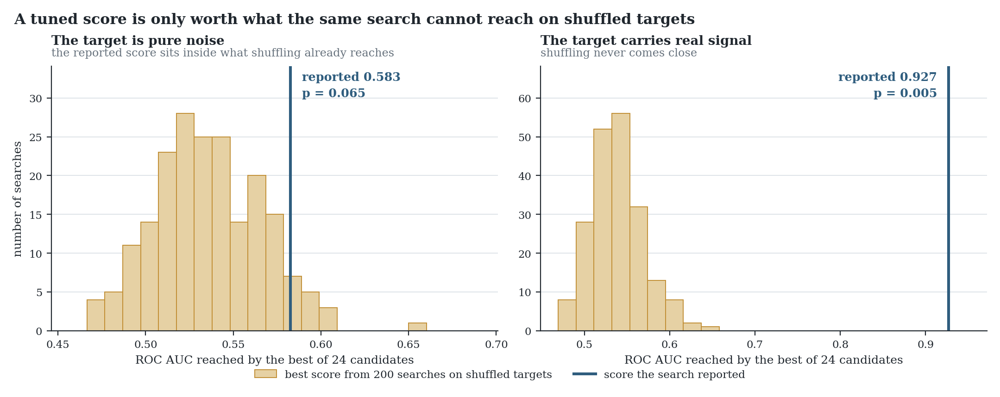
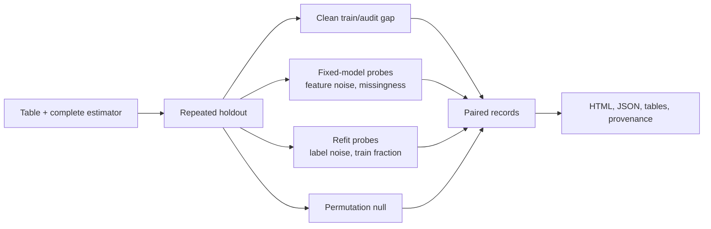
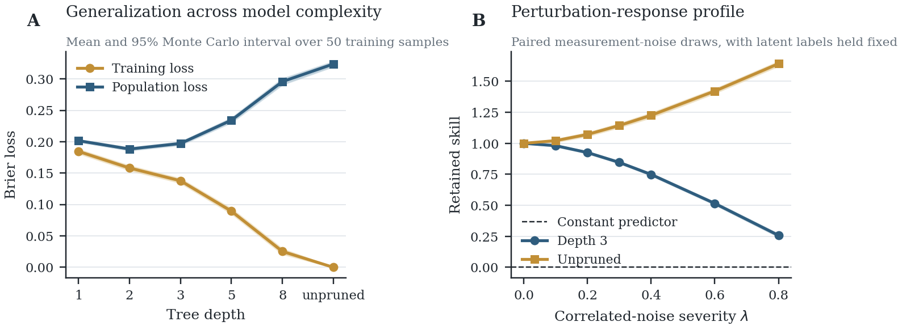
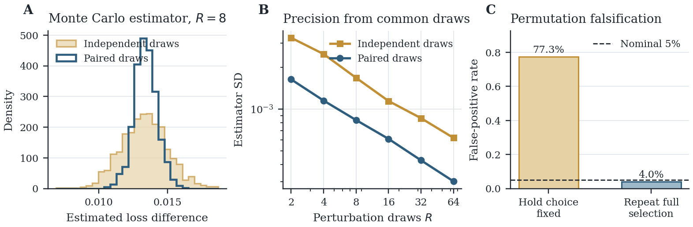
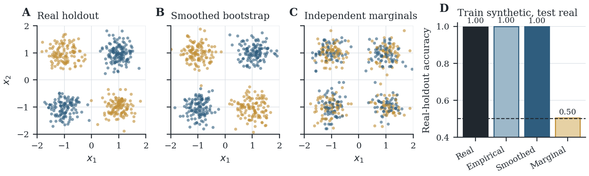

# StressFold

**An overfitting test for tabular models.** If that term is new to you, it means checking whether a model learned a real, general pattern, or whether it just memorized the examples it was trained on and will fall over on anything new.



Both panels show one real 24-candidate grid search, audited by this package. On the left the target is pure noise, and the score the search reported is a score that shuffling also reaches. On the right the target carries real signal and shuffling never gets close. The reported score alone does not tell those two apart. That is the gap this tool exists to close.

## The problem

Say you are predicting which loan applications default. One row per applicant, one column you want to predict:

| age | income | years_employed | past_defaults | **defaulted** |
| --- | --- | --- | --- | --- |
| 34 | 52,000 | 6 | 0 | no |
| 51 | 78,000 | 2 | 1 | yes |

You tune a model over a few hundred configurations and the search reports its best score:

```python
search = GridSearchCV(model, param_grid, cv=5)   # 500 candidates
search.fit(X, y)
search.best_score_                               # 0.91
```

The 0.91 goes into a slide deck. In production the model does 0.72.

Nothing broke. You tried 500 configurations and kept the luckiest one, and the reported score absorbed that luck. The same thing happens quietly when a model is fragile rather than wrong: it holds up on clean data and falls apart the moment a few fields go missing. Neither problem shows up in the number you were given.

## What you get

You bring a table and a model specification, meaning an estimator or a pipeline. StressFold reports four things.

1. How much worse the model does on rows it has never seen.
2. How fast it degrades once the data gets noisy, loses values, carries wrong labels, or gets smaller.
3. Whether its apparent skill survives having the answers shuffled.
4. If the model came out of a hyperparameter search, how much of its score that search awarded itself.

All of it lands in one self-contained HTML report you can open in a browser, plus JSON and ordinary pandas tables.

**What is actually under test.** The unit under test is your training procedure, not one saved model object. StressFold clones the estimator and refits it on the training rows of every split, so passing an already-fitted instance works but its learned state is discarded and relearned. That is deliberate, because refitting inside the split is what keeps preprocessing and selection from leaking across it. The estimand is therefore the risk of the procedure under the stated split policy, which is the quantity you care about when you retrain next quarter. If instead you need to certify one frozen model artifact, score it yourself on data this package never touches.

> Status: `0.3.0` is an alpha research release for binary classification and regression on tabular data. [Read the compiled methods paper](paper/main.pdf) or [open its LaTeX source](paper/main.tex).

## How you run it

There are three ways in, and only one of them tests a model you built yourself.

| Entry point | You supply | Procedure under test | Use it for |
| --- | --- | --- | --- |
| Browser lab | a CSV file | a built-in baseline | seeing what the audit does, without writing code |
| Command line | a CSV file | a built-in baseline | a fast first look at a file |
| Python API | a CSV file and your own estimator or pipeline | **yours** | auditing work you actually care about |

Nothing is uploaded and nothing is pasted into a box. The browser lab reads your CSV inside the page and never sends it anywhere. To audit your own model you import StressFold into the script where that model already lives, then hand the estimator straight to `audit()`.

## Install

StressFold is not yet published to a package index. From a clone:

```bash
python -m pip install -e .
```

For tests and development:

```bash
python -m pip install -e ".[dev]"
```

Python 3.10 or newer is required.

## Quick start

The estimator should contain every learned preprocessing step. Missingness probes require a pipeline that can accept missing values.

```python
from pathlib import Path

import pandas as pd
from sklearn.datasets import make_classification
from sklearn.impute import SimpleImputer
from sklearn.linear_model import LogisticRegression
from sklearn.pipeline import make_pipeline
from sklearn.preprocessing import StandardScaler

from stressfold import AuditConfig, StressSuite, audit

X_values, y_values = make_classification(
    n_samples=500,
    n_features=10,
    n_informative=6,
    class_sep=1.4,
    random_state=7,
)
X = pd.DataFrame(X_values, columns=[f"feature_{i}" for i in range(10)])
y = pd.Series(y_values, name="outcome")

estimator = make_pipeline(
    SimpleImputer(strategy="median"),
    StandardScaler(),
    LogisticRegression(max_iter=2_000, random_state=7),
)

result = audit(
    estimator,
    X,
    y,
    config=AuditConfig(task="binary", repeats=20, random_state=7),
    suite=StressSuite.standard(),
)

output = Path("stressfold-output")
result.write_html(output / "report.html")
result.write_json(output / "results.json")

print(result.generalization_summary())
print(result.permutation_summary())
```

The complete runnable version is in [`examples/python/quickstart.py`](examples/python/quickstart.py), and there is a regression example in [`examples/python/regression_stability.py`](examples/python/regression_stability.py).

For a local CSV, the command-line interface supplies a leakage-safe preprocessing pipeline and a linear or tree baseline:

```bash
stressfold applications.csv \
  --target defaulted \
  --task binary \
  --model linear \
  --repeats 20 \
  --seed 7 \
  --output stressfold-audit
```

Add `--quick` for a smaller protocol or `--export-variants` to retain the perturbed datasets.

## Auditing a hyperparameter search

`audit()` audits one training procedure with its hyperparameters already chosen. If you chose them with a search, the score that search reported is not the score you have, for the reason at the top of this page. `audit_search()` takes the search itself rather than the fitted model:

```python
from sklearn.model_selection import GridSearchCV
from stressfold import SearchAuditConfig, audit_search

search = GridSearchCV(pipeline, param_grid, cv=4, scoring="roc_auc")
report = audit_search(
    search, X, y,
    config=SearchAuditConfig(task="binary", random_state=7),
)
print(report.summary_text())
```

It reports three things separately.

**Selection optimism.** The whole search is wrapped in an outer holdout it never sees, so you can compare the score the search reported to itself against the score its chosen configuration earns outside the search.

**A selection-aware permutation null.** The complete search is rerun against shuffled targets, which tells you what a search of this size reaches when there is no signal at all. This is the figure at the top of this page. Holding the winner fixed and permuting around it instead would understate the null badly, and the paper measures that error at a 77.3% false-positive rate against a nominal 5%.

**Winner stability.** The search is rerun on jittered copies of the table to see whether the same configuration keeps winning. When it does not, those particular settings are not uniquely justified and should not be reported as optimal. This says nothing about whether the score is real, since many configurations are often close to equivalent.

[`examples/python/search_optimism.py`](examples/python/search_optimism.py) reproduces both panels of the header figure.

Two practical notes. The audit refits the search roughly `outer_repeats + permutation_repeats + noise_repeats * levels` times, so start from `SearchAuditConfig.quick()` on anything large. And the smallest p-value reachable with `M` permutations is `1 / (M + 1)`, so 30 permutations cannot report anything below 0.032.

## Outputs

An audit returns ordinary, inspectable pandas tables:

```python
records = result.records_frame()                 # one metric evaluation per run
curves = result.summary_frame()                  # response summaries by operator and level
gaps = result.generalization_summary()           # paired clean train/audit gaps
null = result.permutation_summary()              # descriptive paired null comparison
```

The JSON artifact contains the configuration, stress suite, data fingerprint, estimator representation, named seed ledger, errors, summaries, and optionally all records. The HTML report is self-contained and has no runtime network dependency.

Variant export is opt-in because it can create many files:

```python
config = AuditConfig(task="binary", store_variants=True)
result = audit(estimator, X, y, config=config, suite=StressSuite.standard())
result.export_variants("stressfold-output/variants")
```

Each exported CSV has a manifest entry recording its source fingerprint, split, operator, severity, seed, row provenance, and perturbation metadata.

## Browser lab

The repository includes a local browser lab for inspecting the protocol before writing model code. It accepts CSV files up to 5 MB and 5,000 data rows, runs binary-classification or regression audits over numeric predictors, and offers regularized linear/logistic and nearest-neighbor reference models. Files are parsed and analyzed in the browser, and the current implementation never uploads the dataset. Larger tables are rejected instead of being silently sampled.

```bash
npm ci
npm run dev
```

The lab exports a self-contained report, results JSON, and individual stress variants with manifests. It is deliberately narrower than the Python API and runs on an independent browser implementation, so the two will not agree bit for bit. See [`docs/browser-lab.md`](docs/browser-lab.md) for the boundary between exploratory and research use.

## What it measures

| Evidence | Question | StressFold operation |
| --- | --- | --- |
| Generalization | Does clean held-out performance deteriorate relative to training performance? | Paired train/audit scores over repeated holdouts |
| Robustness | How does a fixed fitted model respond to a named evaluation-time perturbation? | Feature-noise and missingness response curves |
| Falsification | Would the same fitting procedure look as successful after destroying the target association? | Label-permutation refits with a descriptive paired null-exceedance rate |
| Selection | Was a tuned score earned, or produced by picking the best of many candidates? | A complete search rerun inside an outer holdout, inside every permutation, and on jittered replicas |

The first three come from [`audit()`](#quick-start) and the fourth from [`audit_search()`](#auditing-a-hyperparameter-search). Label-noise and reduced-training-set refits are reported separately as **training-stability diagnostics**, because they do not turn robustness into evidence of generalization.



Perturbed and clean scores share the same split. StressFold reports raw metric values and a direction-normalized degradation, where positive always means worse. Its Monte Carlo bands are empirical quantiles across protocol repeats, so they should not be read as classical confidence intervals.

The automated validation matrix covers clear signal, independent labels, nonlinear XOR structure, linear and interaction regression, imbalance, missing values, small samples, unusable targets, duplicate patterns, target proxies, deterministic reruns, and provenance hashing. See [`docs/validation.md`](docs/validation.md) for the expected behavior and claim boundary, and [`docs/methodology.md`](docs/methodology.md) for the exact estimands.

## Evidence from controlled experiments

Every figure below is regenerated by `scripts/reproduce_paper.py` at a fixed root seed of 20260729, using known data-generating processes rather than benchmark datasets. The script does not call the package API, so it works as an independent cross-check.



Training loss falls to zero as the tree deepens, but population Brier loss is minimized at depth 2 (0.188) and degrades to 0.324 once the tree interpolates. Under correlated measurement noise the interpolating tree *improves*, while the depth-3 model loses skill. Robustness therefore cannot stand in for clean predictive risk, because here the two move in opposite directions.



Giving every candidate model the same perturbation draws cuts simulation variance, and at R = 16 independent draws carry 1.87 times the estimator standard deviation of common draws. Panel C is the sharper warning. Selecting the best of 40 random predictors and then permuting labels around that fixed winner yields a 77.3% false-positive rate at a nominal 5%. Repeating the full 40-way selection inside every permutation brings it back to 4.0%.



A generator that samples each feature independently within class reproduces the one-dimensional marginals almost exactly, with a mean class-conditional KS discrepancy of 0.069, and still destroys the dependence that carries the signal. Its real-holdout accuracy is 0.463, no better than chance, while the two bootstrap generators stay at 0.998. This is why generated rows are treated as stress instruments and never as holdout evidence.

## What it does not do

StressFold reports evidence and leaves the judgement to you. It can show you that a model is overfitting. It cannot certify that a model is not, in the same way that a clean test result is never a promise of future health. There is no single score and no pass or fail verdict, because the findings above can disagree with each other, and flattening them into one number hides the thing you wanted to know.

It also does not invent training data. It can write out damaged copies of your own rows so you can see what the audit did to them, and those rows are probes rather than evidence. They cannot grow your sample and they cannot stand in for real holdout observations.

Beyond that:

- Repeated random holdout assumes exchangeable rows. It is not appropriate for grouped, longitudinal, spatial, or temporal dependence without a matching split policy, so a price series or repeated measurements on the same customer need a different tool.
- A response curve characterizes the named operator, not every future distribution shift. Gaussian feature noise is not a substitute for a deployment model.
- The `audit()` permutation summary pools paired null exceedances across overlapping holdouts as a descriptive rate. It is not a p-value. `audit_search()` is the entry point that performs valid permutation inference, because it reruns the complete search inside every permutation.
- Reusing the audit set for model or stressor selection creates optimism. Nest selection when the result will support a decision.
- StressFold does not establish causal validity, calibration, fairness, privacy, or the absence of overfitting. Small samples can produce wide and unstable profiles.

The contribution is a synthesis and reproducible implementation of established validation ideas, plus controlled counterexamples showing why their outputs should not be collapsed into one score. StressFold does not claim a new statistical theorem.

## Reproducibility

A root seed is expanded through a stable, semantic seed tree: split, model fit, stress operation, and permutation seeds are recorded by name. Adding an unrelated stressor does not renumber existing random streams. Zero-severity variants preserve the input exactly, and perturbation scales are estimated from the training fold only.

For a stronger record, retain `results.json`, the source data under its normal access controls, the exact environment lock or package versions, and the code revision. A matching fingerprint detects changed values or schema, and it cannot recover the source data.

The technical paper in [`paper/main.tex`](paper/main.tex) states the estimands, leakage boundaries, and controlled experiments. Its figures and tables are regenerated from fixed-seed scripts, and build instructions are in [`paper/README.md`](paper/README.md). Artifact semantics are in [`docs/reproducibility.md`](docs/reproducibility.md).

## Roadmap

- Group-aware, blocked, and rolling-origin split policies
- Nested selection and calibration diagnostics
- An HTML report for the search audit, which currently emits JSON and pandas frames only
- Domain-informed perturbation operators and comparison reports
- A public benchmark suite with known failure modes
- Generator-audit hooks, gated behind explicit fidelity, privacy, and downstream-utility checks, with generated rows staying stress instruments and never becoming holdout evidence

## Citation, contributing, and security

Use the repository’s [`CITATION.cff`](CITATION.cff) metadata or cite:

> Mirosenski, R. (2026). *StressFold: generalization stress tests for tabular models*. Version 0.3.0. https://github.com/RomanMski/stressfold

Scientific and implementation contributions are welcome, and [`CONTRIBUTING.md`](CONTRIBUTING.md) describes the review expectations. Security reports belong in the private channel described in [`SECURITY.md`](SECURITY.md).

StressFold is released under the [MIT License](LICENSE).
