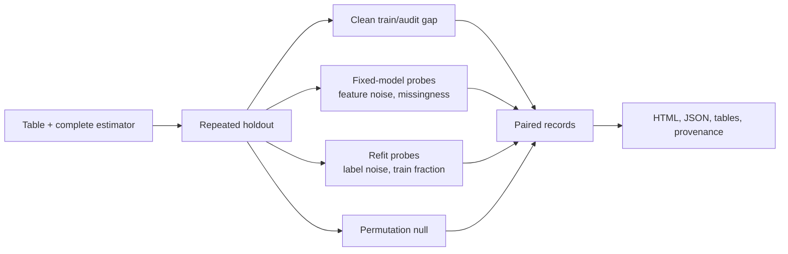

# StressFold

**Generalization stress tests for tabular models.**

StressFold is a local, deterministic audit for scikit-learn-compatible estimators. It runs paired repeated holdouts, measures the clean train–audit gap, traces response curves under declared perturbations, and compares the complete fitting procedure with a label-permutation null.

The name compresses the protocol: controlled **stress** tests repeated across train and audit splits.

It is an experimental instrument, not an overfitting detector and not a synthetic-data generator. Every result is conditional on the split policy, metric, stress operator, and data supplied to the audit.

> Status: `0.1.0` is an alpha research release for binary classification and regression on tabular data.

[Read the compiled methods paper](paper/main.pdf) or [open its LaTeX source](paper/main.tex).

## What it measures

| Evidence | Question | StressFold operation |
| --- | --- | --- |
| Generalization | Does clean held-out performance deteriorate relative to training performance? | Paired train/audit scores over repeated holdouts |
| Robustness | How does a fixed fitted model respond to a named evaluation-time perturbation? | Feature-noise and missingness response curves |
| Falsification | Would the same fitting procedure look as successful after destroying the target association? | Label-permutation refits with a plus-one Monte Carlo p-value |

Label-noise and reduced-training-set refits are reported separately as **training-stability diagnostics**. They do not turn robustness into evidence of generalization.



Perturbed and clean scores share the same split. StressFold reports raw metric values and a direction-normalized degradation, where positive always means worse. Its Monte Carlo bands are empirical quantiles across protocol repeats; they are not classical confidence intervals.

## Install

StressFold is not yet published to a package index. From a clone:

```bash
python -m pip install -e .
```

For tests and development:

```bash
python -m pip install -e ".[dev]"
```

Python 3.10 or newer is required.

## Quick start

The estimator should contain every learned preprocessing step. Missingness probes require a pipeline that can accept missing values.

```python
from pathlib import Path

import pandas as pd
from sklearn.datasets import make_classification
from sklearn.impute import SimpleImputer
from sklearn.linear_model import LogisticRegression
from sklearn.pipeline import make_pipeline
from sklearn.preprocessing import StandardScaler

from stressfold import AuditConfig, StressSuite, audit

X_values, y_values = make_classification(
    n_samples=500,
    n_features=10,
    n_informative=6,
    class_sep=1.4,
    random_state=7,
)
X = pd.DataFrame(X_values, columns=[f"feature_{i}" for i in range(10)])
y = pd.Series(y_values, name="outcome")

estimator = make_pipeline(
    SimpleImputer(strategy="median"),
    StandardScaler(),
    LogisticRegression(max_iter=2_000, random_state=7),
)

result = audit(
    estimator,
    X,
    y,
    config=AuditConfig(task="binary", repeats=20, random_state=7),
    suite=StressSuite.standard(),
)

output = Path("stressfold-output")
result.write_html(output / "report.html")
result.write_json(output / "results.json")

print(result.generalization_summary())
print(result.permutation_summary())
```

The complete runnable version is in [`examples/python/quickstart.py`](examples/python/quickstart.py); a regression example is in [`examples/python/regression_stability.py`](examples/python/regression_stability.py).

For a local CSV, the command-line interface supplies a leakage-safe preprocessing pipeline and a linear or tree baseline:

```bash
stressfold sample.csv \
  --target outcome \
  --task binary \
  --model linear \
  --repeats 20 \
  --seed 7 \
  --output stressfold-audit
```

Add `--quick` for a smaller protocol or `--export-variants` to retain the perturbed datasets.

## Outputs

An audit returns ordinary, inspectable pandas tables:

```python
records = result.records_frame()                 # one metric evaluation per run
curves = result.summary_frame()                  # response summaries by operator and level
gaps = result.generalization_summary()           # paired clean train/audit gaps
null = result.permutation_summary()               # plus-one permutation results
```

The JSON artifact contains the configuration, stress suite, data fingerprint, estimator representation, named seed ledger, errors, summaries, and optionally all records. The HTML report is self-contained and has no runtime network dependency.

Variant export is opt-in because it can create many files:

```python
config = AuditConfig(task="binary", store_variants=True)
result = audit(estimator, X, y, config=config, suite=StressSuite.standard())
result.export_variants("stressfold-output/variants")
```

Each exported CSV has a manifest entry recording its source fingerprint, split, operator, severity, seed, row provenance, and perturbation metadata. These files are controlled probes, not new independent observations.

## Browser lab

The repository includes a local browser lab for inspecting the protocol before writing model code. It accepts CSV files up to 5 MB, runs binary-classification or regression audits over numeric predictors, and offers regularized linear/logistic and nearest-neighbor reference models. Files are parsed and analyzed in the browser; the current implementation does not upload the dataset.

```bash
npm ci
npm run dev
```

The lab exports a self-contained report, results JSON, and individual stress variants with manifests. It is deliberately narrower than the Python API and uses an independent browser implementation; do not expect bit-for-bit equivalence. See [`docs/browser-lab.md`](docs/browser-lab.md) for the boundary between exploratory and research use.

## Interpretation and limitations

- Repeated random holdout assumes exchangeable rows. It is not appropriate for grouped, longitudinal, spatial, or temporal dependence without a matching split policy.
- A response curve characterizes the named operator, not every future distribution shift. Gaussian feature noise is not a substitute for a deployment model.
- The permutation result depends on label exchangeability and the complete selection procedure being rerun. A small p-value is evidence of predictive association under that null, not proof of useful deployment performance.
- Reusing the audit set for model or stressor selection creates optimism. Nest selection when the result will support a decision.
- StressFold does not establish causal validity, calibration, fairness, privacy, or the absence of overfitting. Small samples can produce wide and unstable profiles.

The exact estimands and operator definitions are in [`docs/methodology.md`](docs/methodology.md). Reproduction and artifact semantics are in [`docs/reproducibility.md`](docs/reproducibility.md).

## Reproducibility

A root seed is expanded through a stable, semantic seed tree: split, model fit, stress operation, and permutation seeds are recorded by name. Adding an unrelated stressor does not renumber existing random streams. Zero-severity variants preserve the input exactly, and perturbation scales are estimated from the training fold only.

For a stronger record, retain `results.json`, the source data under its normal access controls, the exact environment lock or package versions, and the code revision. A matching fingerprint detects changed values or schema; it does not recover the source data.

The technical paper in [`paper/main.tex`](paper/main.tex) states the estimands, leakage boundaries, and controlled experiments. Its figures and tables are regenerated from fixed-seed scripts; build instructions are in [`paper/README.md`](paper/README.md).

## Roadmap

- Group-aware, blocked, and rolling-origin split policies
- Nested selection and calibration diagnostics
- Domain-informed perturbation operators and comparison reports
- A public benchmark suite with known failure modes
- Conditional replica or diffusion models only after explicit fidelity, privacy, and downstream-utility gates; generated rows will remain stress instruments, never extra holdout evidence

## Citation, contributing, and security

Use the repository’s [`CITATION.cff`](CITATION.cff) metadata or cite:

> StressFold contributors (2026). *StressFold: generalization stress tests for tabular models*. Version 0.1.0.

Scientific and implementation contributions are welcome; see [`CONTRIBUTING.md`](CONTRIBUTING.md). Security reports belong in the private channel described in [`SECURITY.md`](SECURITY.md).

StressFold is released under the [MIT License](LICENSE).
