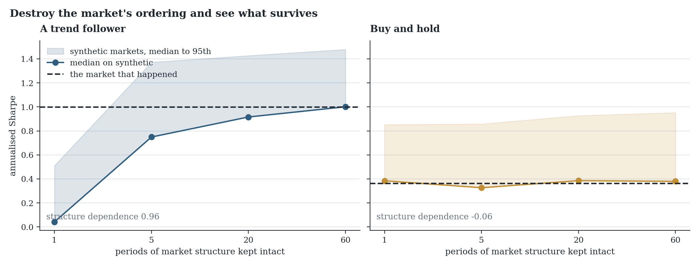

# OverfitLab

### [Open the demo](https://romanmski.github.io/overfitlab/) · [Read the paper](paper/main.pdf)

You tried 200 parameter combinations and kept the best one. It shows a Sharpe of 1.5. So does the best of 200 random ones. This tells you which of those two you have.



## What it checks

Run it on 60 configurations built from pure noise, with a true Sharpe of exactly zero in every one, and the best of them still comes out at 1.29 annualised. The best of 60 coin flips reaches about 1.37, so 1.29 is actually below what luck alone produces. On its own that number would pass most informal screening. The deflated Sharpe ratio works out that bar for however many things you tried and checks whether your result clears it.

The second check splits your history in half every possible way, finds the best configuration in one half, and looks at where it ranks in the other. If the winner usually lands below the median of its peers then the thing selecting it is not finding anything, and above 0.5 means you would have done better choosing at random.

The third one is different in kind. Both of the others ask whether your result beats what searching produces by chance. Neither asks whether the market held anything to find. So this takes your price history, resamples it hundreds of times at a range of block lengths, and reruns your strategy on every version. At block 1 the returns are drawn independently and no ordering survives. At block 60 runs of sixty periods stay intact and only their arrangement changes.

Reading the gradient is the point. In the figure above a trend follower earns 1.00 on the market that happened, collapses to 0.04 once the ordering is destroyed, and climbs back to 1.00 as the runs return. Buy and hold earns 0.36 and earns 0.38 shuffled, flat at every block length, because reordering a series cannot change its mean.

Worth being careful here, because it is easy to say the shuffled version is noise and it is not. Shuffling keeps the mean, the variance, the skew and every fat tail exactly as they were. It only changes the order. That is why buy and hold does not notice. And a strategy that dies under shuffling has shown its result needs the ordering, which is consistent with a timing edge but also with volatility targeting, sizing that reacts to recent variance, or a lookback bug. It narrows the question rather than settling it.

## Using it

```python
from overfitlab import (
    deflated_sharpe_ratio,
    path_stress,
    probability_of_backtest_overfitting,
)

# trials: (periods, configurations), every configuration you tried
deflated_sharpe_ratio(trials, periods_per_year=252)
probability_of_backtest_overfitting(trials, n_splits=16)

# your strategy on markets that never happened
path_stress(strategy, market_returns, block_sizes=(1, 5, 20, 60))
```

Pass every configuration you tried, including the ones that did badly. Dropping those is the exact bias these numbers exist to catch.

```bash
python -m pip install -e .
```

Python 3.10 or newer, with NumPy, pandas and SciPy. The [demo](https://romanmski.github.io/overfitlab/) runs the same maths in the browser with nothing to install, and its last panel takes a CSV of your own returns and reports both statistics without uploading anything. Locally that is `npm ci && npm run dev`.

## What it cannot do

Both selection statistics assume your trials are roughly interchangeable draws. If you searched adaptively and abandoned the bad regions early then the number of trials you ran is not the number that counts, and both will flatter you.

The overfitting probability ignores time order entirely. It draws combinations of blocks without caring which came first, so a strategy that worked until the regime changed and then stopped looks fine to it. That is how the published method works, and it is why it is not reported on its own here.

Resampling keeps volatility clustering inside a block and loses it across the joins, so the synthetic paths are calmer in the tails than the series they came from. Nothing anywhere models transaction costs, and a strategy trading daily can lose most of a 1.00 Sharpe to spread and slippage without any of these numbers noticing.

Passing all three is not evidence of an edge. It means selection alone does not explain your result, which is a much smaller claim and the only one the arithmetic supports.

## Notes

The demonstrations use simulated markets with known properties, so the right answer is known in advance. That makes them clean counterexamples rather than evidence about any real market.

The figure is generated by the package itself through `scripts/make_figures.py`, so the numbers in the text and the numbers in the plot cannot drift apart. Tests check statistical behaviour rather than frozen outputs. Independent resampling has to destroy autocorrelation while block resampling retains most of it, a strategy with a real timing edge has to collapse under shuffling where a long only one does not, and the browser implementation has to agree with the Python one to six decimal places against SciPy reference values.

Built on the deflated Sharpe ratio of Bailey and López de Prado (2014), the probability of backtest overfitting of Bailey, Borwein, López de Prado and Zhu (2016), and the stationary bootstrap of Politis and Romano (1994). The [paper](paper/main.pdf) has the details and the argument.

MIT licensed.
